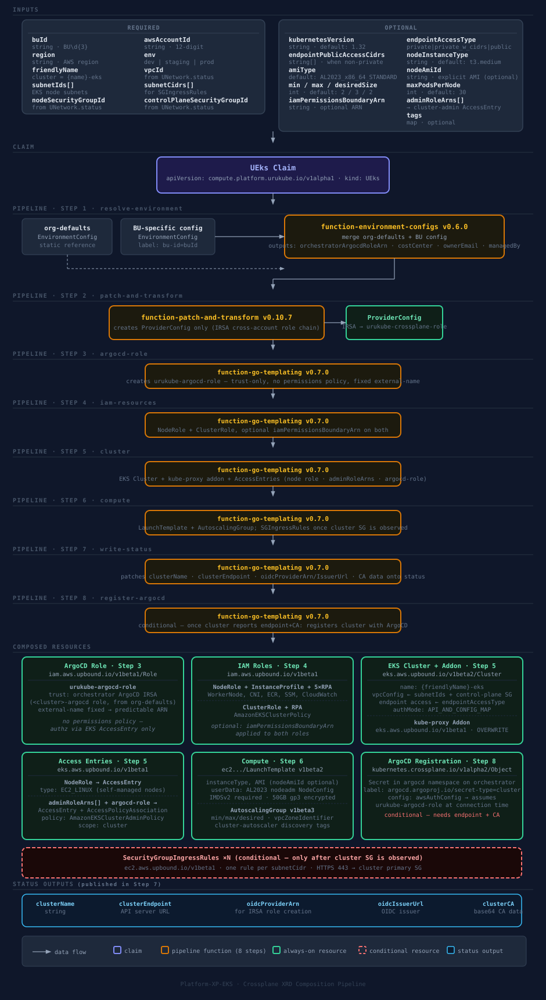

# platform-xp-eks

Crossplane XRD package that provides a self-service EKS cluster golden path for the `urukube` platform. ArgoCD auto-discovers this repo via the `platform-custom-xrds` GitHub topic and deploys it to `crossplane-system` on the orchestrator cluster.

This package implements **Option A** of the two-repo cluster pattern: networking and compute are provisioned by separate claims. The VPC outputs from a `UNetwork` claim (`platform-xp-networking`) are passed manually as parameters into the `UEks` claim.

## Composition pipeline



## What gets provisioned

Every `UEks` claim creates the following AWS resources in the target account:

| Resource | Configurable |
|---|---|
| IAM node role + instance profile | No — always created |
| IAM policy attachments (EKSWorkerNode, CNI, ECR, SSM, CloudWatch) | No — always attached |
| EKS Cluster | Name, version, endpoint access mode |
| kube-proxy addon | No — always installed, pinned to most recent |
| AL2023 LaunchTemplate | Instance type, AMI, maxPods, node labels |
| Self-managed AutoScalingGroup | Min/max/desired size, cluster-autoscaler tags |
| SecurityGroupIngressRule per subnet CIDR | No — auto-created once cluster is Ready |
| ArgoCD cluster-registration Secret (on the orchestrator cluster) | No — always created once cluster is Ready |

## Parameters

| Field | Required | Default | Description |
|---|---|---|---|
| `spec.parameters.awsAccountId` | Yes | — | 12-digit AWS account ID |
| `spec.parameters.region` | Yes | — | AWS region (e.g. `us-east-1`) |
| `spec.parameters.buId` | Yes | — | Business Unit ID (e.g. `BU001`) |
| `spec.parameters.env` | Yes | — | Environment: `dev`, `staging`, or `prod` |
| `spec.parameters.friendlyName` | Yes | — | Short name prefix — cluster name will be `<friendlyName>-eks` |
| `spec.parameters.vpcId` | Yes | — | VPC ID from `UNetwork` claim `status.vpcId` |
| `spec.parameters.subnetIds` | Yes | — | EKS node subnet IDs from `UNetwork` claim `status.eksNodeSubnetIds` |
| `spec.parameters.subnetCidrs` | Yes | — | EKS node subnet CIDRs — used to open HTTPS to the cluster control plane |
| `spec.parameters.nodeSecurityGroupId` | Yes | — | From `UNetwork` claim `status.nodeSecurityGroupId` |
| `spec.parameters.controlPlaneSecurityGroupId` | Yes | — | From `UNetwork` claim `status.controlPlaneSecurityGroupId` |
| `spec.parameters.kubernetesVersion` | No | `1.32` | Kubernetes minor version |
| `spec.parameters.endpointAccessType` | No | `private` | `private`, `private_with_public_cidrs`, or `public` |
| `spec.parameters.endpointPublicAccessCidrs` | No | — | CIDRs for public endpoint access. Required when `endpointAccessType` is `private_with_public_cidrs` |
| `spec.parameters.nodeInstanceType` | No | `t3.medium` | EC2 instance type for worker nodes |
| `spec.parameters.amiType` | No | `AL2023_x86_64_STANDARD` | AMI type: `AL2023_x86_64_STANDARD` or `AL2_x86_64` |
| `spec.parameters.nodeAmiId` | No | — | Explicit AMI ID. Find the latest via SSM (see below) |
| `spec.parameters.minSize` | No | `2` | Minimum worker nodes |
| `spec.parameters.maxSize` | No | `3` | Maximum worker nodes |
| `spec.parameters.desiredSize` | No | `2` | Desired worker nodes |
| `spec.parameters.maxPodsPerNode` | No | `30` | Maximum pods per node (nodeadm kubelet config) |
| `spec.parameters.adminRoleArns` | No | — | IAM role ARNs to grant cluster-admin access via EKS access entries (e.g. operator or CI roles) |
| `spec.parameters.iamPermissionsBoundaryArn` | No | — | IAM permissions boundary ARN for all roles created by this composition |
| `spec.parameters.tags` | No | — | Additional tags as key-value pairs |

### Finding the latest AL2023 AMI ID

```bash
aws ssm get-parameter \
  --name /aws/service/eks/optimized-ami/1.32/amazon-linux-2023/x86_64/standard/recommended/image_id \
  --region us-east-1 \
  --query Parameter.Value \
  --output text
```

## Example claims

Production cluster (private endpoint, 3 AZs, `m5.large` nodes):
```yaml
apiVersion: compute.platform.urukube.io/v1alpha1
kind: UEks
metadata:
  name: bu001-prod-eks
  namespace: bu001
spec:
  parameters:
    buId: BU001
    awsAccountId: "222222222222"
    region: us-east-1
    env: prod
    friendlyName: bu001-prod
    # --- from UNetwork claim status ---
    vpcId: vpc-0abc123456789
    subnetIds:
      - subnet-0aaa111111111111
      - subnet-0bbb222222222222
      - subnet-0ccc333333333333
    subnetCidrs:
      - 10.0.0.0/19
      - 10.0.32.0/19
      - 10.0.64.0/19
    nodeSecurityGroupId: sg-0node111111111111
    controlPlaneSecurityGroupId: sg-0cp222222222222
    # --- cluster config ---
    kubernetesVersion: "1.32"
    endpointAccessType: private
    nodeInstanceType: m5.large
    minSize: 2
    maxSize: 6
    desiredSize: 3
```

Dev cluster (public endpoint restricted to VPN CIDR, `t3.medium` nodes, single AZ):
```yaml
apiVersion: compute.platform.urukube.io/v1alpha1
kind: UEks
metadata:
  name: bu001-dev-eks
  namespace: bu001
spec:
  parameters:
    buId: BU001
    awsAccountId: "111111111111"
    region: us-east-1
    env: dev
    friendlyName: bu001-dev
    # --- from UNetwork claim status ---
    vpcId: vpc-0def987654321
    subnetIds:
      - subnet-0ddd444444444444
      - subnet-0eee555555555555
    subnetCidrs:
      - 10.1.0.0/19
      - 10.1.32.0/19
    nodeSecurityGroupId: sg-0node333333333333
    controlPlaneSecurityGroupId: sg-0cp444444444444
    # --- cluster config ---
    kubernetesVersion: "1.32"
    endpointAccessType: private_with_public_cidrs
    endpointPublicAccessCidrs:
      - 203.0.113.0/24
    nodeInstanceType: t3.medium
    minSize: 1
    maxSize: 3
    desiredSize: 1
```

## Supplying networking inputs (Option A hand-off)

Read the outputs from your `UNetwork` claim and paste them into the `UEks` claim:

```bash
kubectl get unetwork <claim-name> -n <namespace> -o jsonpath='{.status}' | jq
```

| `UNetwork` status field | `UEks` parameter |
|---|---|
| `status.vpcId` | `spec.parameters.vpcId` |
| `status.eksNodeSubnetIds` | `spec.parameters.subnetIds` |
| `status.nodeSecurityGroupId` | `spec.parameters.nodeSecurityGroupId` |
| `status.controlPlaneSecurityGroupId` | `spec.parameters.controlPlaneSecurityGroupId` |

The `subnetCidrs` parameter must match the `eksNodeSubnetCidrs` values used in the `UNetwork` claim.

## Cross-account setup

The composition dynamically creates an `aws.upbound.io/v1beta1 ProviderConfig` per claim that chains the orchestrator's IRSA role into the target account:

```
Orchestrator IRSA role → sts:AssumeRole → arn:aws:iam::<awsAccountId>:role/urukube-crossplane-role
```

Each target AWS account must have a role named `urukube-crossplane-role` with:

1. **Trust policy** — allows the orchestrator's Crossplane IRSA role to assume it:

```json
{
  "Effect": "Allow",
  "Principal": {
    "AWS": "arn:aws:iam::<orchestrator-account-id>:role/<crossplane-irsa-role-name>"
  },
  "Action": "sts:AssumeRole"
}
```

2. **Permissions** — EKS, EC2, IAM, and autoscaling access required to manage cluster resources:

```json
{
  "Effect": "Allow",
  "Action": ["eks:*", "ec2:*", "iam:*", "autoscaling:*"],
  "Resource": "*"
}
```

`urukube-argocd-role` — used solely to give the orchestrator's ArgoCD an identity for EKS API auth (see "ArgoCD registration" below) — does **not** need to be created manually. The composition provisions it in the target account itself, in its own dedicated step (Step 3, `argocd-role`) ahead of every other resource, with a fixed `crossplane.io/external-name: urukube-argocd-role` so its ARN is predictable. It has **no permissions policy at all** — authorization happens entirely through the cluster's EKS Access Entry (Step 5), not IAM. Its trust policy names the orchestrator's existing ArgoCD IRSA role, `<cluster_name>-argocd` (provisioned by `orchestrator-custom-addons`'s `argocd-role.tf`), read from the `orchestratorArgocdRoleArn` field in the `org-defaults` `EnvironmentConfig` (`platform-tenant-registry/org/environmentconfig.yaml`):

```json
{
  "Effect": "Allow",
  "Principal": {
    "AWS": "arn:aws:iam::<orchestrator-account-id>:role/<cluster_name>-argocd"
  },
  "Action": "sts:AssumeRole"
}
```

The only thing operators must do per organization (not per account) is keep `orchestratorArgocdRoleArn` in `org-defaults` accurate.

## ArgoCD registration

Every `UEks` claim automatically registers its cluster with the orchestrator's ArgoCD once the cluster is `Ready`. The composition:

1. Creates `urukube-argocd-role` in the target account (Step 3), trusting the orchestrator's ArgoCD IRSA role — fully self-service, no manual per-account IAM setup.
2. Grants that role a cluster-admin `AccessEntry`/`AccessPolicyAssociation` (Step 5) — reusing the same mechanism as `adminRoleArns`.
3. Creates a `Secret` named `<friendlyName>-eks-argocd-cluster` in the `argocd` namespace on the orchestrator cluster (Step 8, via `provider-kubernetes`, `InjectedIdentity`), labeled `argocd.argoproj.io/secret-type: cluster`.

The Secret's `config` uses ArgoCD's `awsAuthConfig` — ArgoCD assumes `urukube-argocd-role` cross-account at connection time to generate a short-lived EKS token, the same way `aws eks get-token` does. No credentials are stored in the Secret, the target account, or anywhere else.

The orchestrator's ArgoCD already has its own IRSA role (`<cluster_name>-argocd`, from `orchestrator-custom-addons`) permitted to `sts:AssumeRole` on any account/role — nothing further to provision there.

## Status outputs

Once the cluster is `Ready`, the following fields are populated and can be used to create IRSA roles or configure `kubeconfig`:

| Field | Description |
|---|---|
| `status.clusterName` | EKS cluster name |
| `status.clusterEndpoint` | API server endpoint URL |
| `status.oidcProviderArn` | OIDC provider ARN — used to create IRSA roles |
| `status.oidcIssuerUrl` | OIDC issuer URL |
| `status.clusterCertificateAuthorityData` | Base64-encoded CA data |

## Files

| File | Purpose |
|---|---|
| `provider.yaml` | Installs `provider-aws-eks`, `provider-aws-autoscaling`, `provider-aws-iam` at v1.21.0 (`provider-aws-ec2` is shared via `platform-xp-crossplane-shared`); declares this repo's scoped `Role`/`RoleBinding` on `argocd` Secrets for the shared `provider-kubernetes` install (`platform-xp-crossplane-shared/provider-kubernetes.yaml`), used for ArgoCD registration |
| `xrd.yaml` | Defines the `XUEks` / `UEks` API and parameter schema |
| `composition.yaml` | Maps a claim to all EKS resources and publishes cluster outputs to status |
